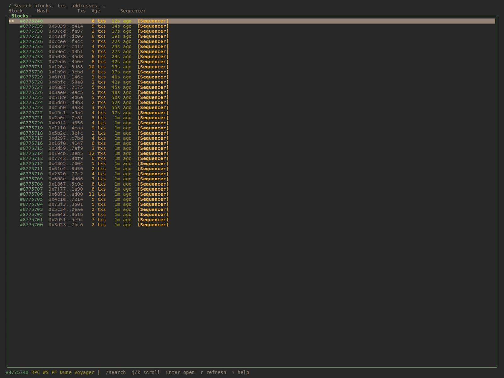
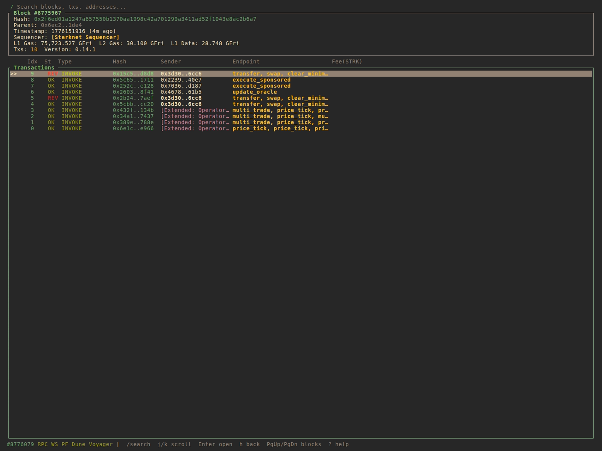
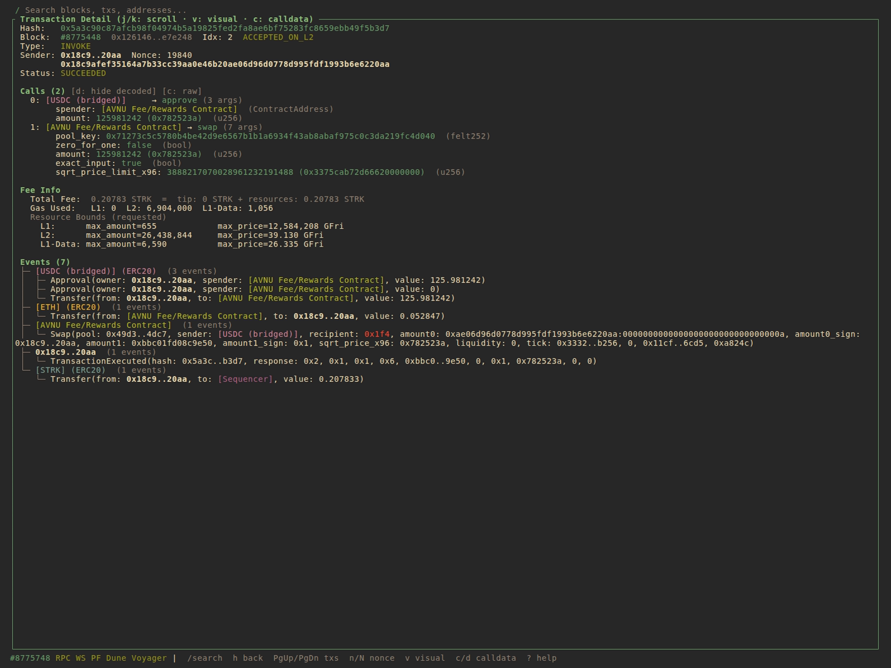
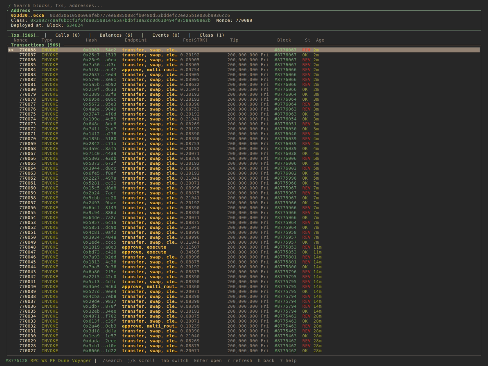
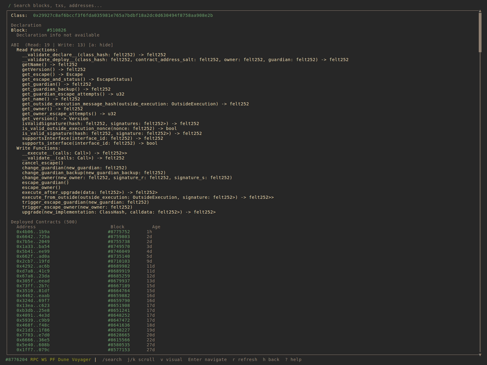

# snbeat

snbeat is a local, terminal based , Block explorer for the Starknet Blockchain. It supports multiple data sources, to give the best experience, while prioritizing privacy, recency and caching.



- Privacy first: snbeat works best with a local RPC node, and can connect directly to the Pathfinder DB. Fully local. External APIs (Dune/Voyager) can be used but are optional. It is open source. Hack any feature you need.
- Cache first: Every fetched data is cached. Any data visited is cached for subsequent queries. No unnecessary indexing of data that is never used.
- Recency first: See recent txs first, stream incoming txs, wait longer for full data fetch.
- Vim!

## Features

- **Live block feed** — polls the chain every 3 s (or subscribes via WebSocket)
- **ABI-aware decoding** — decodes calldata, events, and multicalls using on-chain class ABIs
- **Data backends** — RPC, WS, Pathfinder query service, Dune and Voyager can be used simultaneously to fetch data
- **Persistent local cache** — SQLite; blocks, transactions, receipts, and ABIs are cached for instant fetch on subsequent visits
- **Custom labels** — tag addresses and transactions with human-readable names and searchable tags
- **Fast search** — prefix/substring search over labelled addresses; navigate by hash or block number
- **Nonce-based and Block based navigation** — jump to the next/previous transaction by account, by index, or jump to the next block

---

## Data Backends

snbeat can draw data from three sources simultaneously. Configure only the ones you have access to.

### RPC (required)

All data fetching starts here. Set `APP_RPC_URL` to any Starknet JSON-RPC v0.7+ endpoint (local node or hosted).

```
APP_RPC_URL=http://localhost:9545/rpc/v0_10
```

An optional WebSocket URL enables push-based block, txs and events

```
APP_WS_URL=ws://localhost:9545/ws
```

### Pathfinder Query Service (optional, recommended for local nodes)

If you run a [Pathfinder](https://github.com/eqlabs/pathfinder) node, the bundled `pf-query` service exposes its SQLite database over HTTP. This unlocks fast data lookups, which power the address timeline.

See [Setting up pf-query](#setting-up-pf-query) below.

```
APP_PATHFINDER_SERVICE_URL=http://localhost:8234
```

### Dune Analytics (optional)

A Dune API key enables two additional features:

- **Reverted transaction detection** — reverted txs appear differently from successful ones
- **Contract call history** — the _Calls_ tab on an address shows all transactions that called that contract

```
DUNE_API_KEY=your_key_here
```

### Voyager API (optional)

Connect to Voyager API to optionally get Voyager tags for addresses, classes etc

```
VOYAGER_API_KEY=your_key_here
```

---

## Installation

### Prerequisites

- Rust 1.85+ (edition 2024)
- A Starknet RPC endpoint

### Install via cargo

```bash
cargo install --git https://github.com/amanusk/snbeat
```

Then place your config in `~/.config/snbeat/` (see [Configuration](#configuration) below).

### Build from source

```bash
git clone https://github.com/amanusk/snbeat
cd snbeat
cargo build --release
```

The binary is at `target/release/snbeat`.

### Run

```bash
# From the repo (uses local .env)
cp .env.example .env
cargo run --release

# Or directly
./target/release/snbeat
```

snbeat reads environment variables directly, so you can also export them in your shell or pass them inline:

```bash
APP_RPC_URL=http://localhost:9545/rpc/v0_10 snbeat
```

---

## Configuration

snbeat looks for configuration files in two locations, with local files taking priority:

1. **Current working directory** — for development or per-project setups
2. **`~/.config/snbeat/`** — for system-wide installs (e.g. `cargo install`)

This applies to both `.env` and `labels.toml`. If a file exists in the current directory it is used; otherwise snbeat falls back to `~/.config/snbeat/`.

### Quick setup (cargo install)

```bash
mkdir -p ~/.config/snbeat
cp .env.example ~/.config/snbeat/.env
# Edit ~/.config/snbeat/.env with your settings
```

### Environment variables

All variables are optional except `APP_RPC_URL`.

| Variable                     | Default                 | Description                                    |
| ---------------------------- | ----------------------- | ---------------------------------------------- |
| `APP_RPC_URL`                | _(required)_            | Starknet JSON-RPC endpoint                     |
| `APP_WS_URL`                 | —                       | WebSocket endpoint for new-block subscriptions |
| `APP_PATHFINDER_SERVICE_URL` | —                       | URL of a running `pf-query` instance           |
| `VOYAGER_API_KEY`            | —                       | Voyager API key for address metadata           |
| `DUNE_API_KEY`               | —                       | Dune Analytics API key                         |
| `APP_USER_LABELS`            | `labels.toml`           | Path to your custom labels file                |
| `APP_LOG_LEVEL`              | `info`                  | `trace` / `debug` / `info` / `warn` / `error`  |
| `APP_LOG_DIR`                | `~/.config/snbeat/logs` | Log file directory                             |

---

## Custom Labels

Create a `labels.toml` file to tag addresses and transactions with names and searchable tags. Place it in the current directory or in `~/.config/snbeat/labels.toml` for a global install.

```toml
[addresses]
# Simple name
"0x049d36570d4e46f48e99674bd3fcc84644ddd6b96f7c741b1562b82f9e004dc7" = "ETH"

# Name + tags (tags are searchable in the / search bar)
"0x049d36570d4e46f48e99674bd3fcc84644ddd6b96f7c741b1562b82f9e004dc7" = { name = "My Wallet", tags = ["defi", "nft"] }

[transactions]
# Optional transaction labels
"0xabc123..." = "Initial deploy"
```

User labels take priority over the built-in known address registry (tokens, DEXes, bridges, etc.). The file is loaded at startup; a malformed file prints a warning but does not prevent startup.

---

## ABI Decoding

snbeat fetches the class ABI for every contract it encounters and decodes:

- **Calldata** — function arguments with named parameters and typed values (u256, structs, enums, arrays, …)
- **Multicalls** — account transactions that bundle multiple inner calls are unpacked individually
- **Events** — keys and data fields are matched against the ABI and rendered with parameter names

Decoded ABIs are stored in the local SQLite cache (`~/.config/snbeat/cache.db`) and are never re-fetched.

Press `d` in a transaction detail view to toggle between raw and decoded calldata.

---

## Local Cache

All fetched data is persisted to `~/.config/snbeat/cache.db` (SQLite). The cache stores:

- Block headers
- Transactions and receipts
- Per-address event and transaction lists
- Parsed ABIs (keyed by class hash)

On subsequent visits to the same block or address, data is served from disk with no network round-trip.

---

## Keybindings

### Navigation

| Key                 | Action                              |
| ------------------- | ----------------------------------- |
| `j` / `↓`           | Move down                           |
| `k` / `↑`           | Move up                             |
| `l` / `→` / `Enter` | Drill in / navigate forward         |
| `h` / `←` / `Esc`   | Go back                             |
| `Ctrl+O`            | Jump back (vim-style)               |
| `]`                 | Jump forward                        |
| `g`                 | Jump to top                         |
| `G`                 | Jump to bottom                      |
| `Ctrl+U` / `PgUp`   | Next block or transaction           |
| `Ctrl+D` / `PgDn`   | Previous block or transaction       |
| `n`                 | Next transaction by same sender     |
| `N`                 | Previous transaction by same sender |
| `Tab`               | Cycle tabs (Address Info view)      |
| `q`                 | Jump to home / quit                 |
| `Ctrl+C`            | Quit                                |

### Search

Press `/` to open the search bar. You can search by:

- Address or transaction hash (0x…)
- Block number
- Label name or tag

Arrow keys to navigate suggestions; `Enter` confirms; `Tab` fills in the highlighted suggestion; `Esc` closes.

### Transaction Detail

| Key | Action                                               |
| --- | ---------------------------------------------------- |
| `c` | Toggle raw calldata                                  |
| `d` | Toggle ABI-decoded calldata                          |
| `v` | Enter visual mode (highlight addresses / block refs) |
| `r` | Refresh                                              |
| `?` | Toggle help overlay                                  |

### Visual Mode

Press `v` in a Transaction or Block detail view to enter visual mode. Use `j`/`k` to cycle through addresses and block references, then `Enter` to navigate to the highlighted item. `Esc` exits.

---

## Setting up pf-query

`pf-query` is a lightweight HTTP service that exposes the Pathfinder SQLite database for fast nonce-history queries. It lives in `crates/pf-query/`.

### Build and run locally

```bash
# Build
cargo build --release --manifest-path crates/pf-query/Cargo.toml

# Run (point it at your Pathfinder database)
PF_DB_PATH=/var/lib/pathfinder/pathfinder.db ./target/release/pf-query
# Listening on 0.0.0.0:8234 by default
```

| Variable     | Default      | Description                            |
| ------------ | ------------ | -------------------------------------- |
| `PF_DB_PATH` | _(required)_ | Path to the Pathfinder SQLite database |
| `PF_PORT`    | `8234`       | Port to listen on                      |
| `PF_HOST`    | `127.0.0.1`  | Host address to bind to                |

### Run on a remote server

If your Pathfinder node is on a different machine, run `pf-query` on that machine and set `APP_PATHFINDER_SERVICE_URL` in your snbeat `.env` to point at it:

```
APP_PATHFINDER_SERVICE_URL=http://192.168.1.10:8234
```

### API

| Endpoint                                | Description                                             |
| --------------------------------------- | ------------------------------------------------------- |
| `GET /health`                           | Returns `{ "latest_block": N }`                         |
| `GET /nonce-history/{address}?limit=N`  | Returns ordered nonce update history (max 2000 entries) |
| `GET /class-history/{address}`          | Returns class hash history for a contract               |
| `GET /contracts-by-class/{class_hash}`  | Returns contracts deployed with a given class hash      |
| `GET /class-declaration/{class_hash}`   | Returns declaration info for a class hash               |
| `GET /tx-by-hash/{hash}`               | Looks up a transaction by hash                          |
| `GET /block-txs/{block_number}`         | Returns decoded transactions in a block                 |
| `GET /sender-txs/{address}`            | Returns transactions sent by an address                 |
| `GET /contract-events/{address}`        | Returns events emitted by a contract                    |

---

## Screenshots

<table>
  <tr>
    <td><strong>Block Detail</strong><br></td>
    <td><strong>Transaction Detail</strong><br></td>
  </tr>
  <tr>
    <td><strong>Address Info</strong><br></td>
    <td><strong>Class Info</strong><br></td>
  </tr>
</table>

---

## Testing

```bash
# Unit and integration tests (no network required)
cargo test

# RPC-dependent integration tests (requires APP_RPC_URL in .env)
cargo test -- --ignored
```

---

## License

This project is licensed under the [MIT License](LICENSE).

---

## Contributing

1. Fork the repository and create a feature branch.
2. Run `cargo fmt` and `cargo clippy` before opening a PR.
3. Add tests for new behaviour where practical.
4. Keep PRs focused; one feature or fix per PR.

Please open an issue first for significant changes to discuss the approach.
